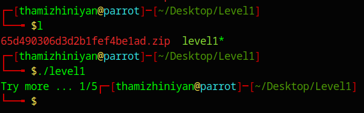

# Level 1

## Overview


Link to the Challenge


| Author  | Language | Architecture |
| ------- | -------- | ------------ |
| nimacpp | C/C++    | x86-64       |

***

## Initial Setup

Download the given file and unzip it. The password for the zip is '`crackmes.one`'.

***

## Application Interaction

The given file is a Linux Executable file.

<figure><figcaption></figcaption></figure>

When I executed the program, it displayed 'Try more ... 1/5'.

<figure><figcaption></figcaption></figure>

When I executed the program with one or more arguments, it echoes the following,

<figure><figcaption></figcaption></figure>

***

## Static Analysis using Ghidra

### Initial Setup

Open Ghidra, Create a new Project, import the given file by choosing File -> Import.

Once imported the file, double click to open it in Ghidra.

Select 'Yes', when it prompts for Analyzing the file.

<figure><figcaption></figcaption></figure>

Select 'Decompiler Parameter ID' option from the list of Analyszer and click Analyze.

<figure><figcaption></figcaption></figure>

***

### Function: main()

Find the Main function from the 'Symbol Tree' widget and select it.

<figure><figcaption></figcaption></figure>

You can see the decompiled code of the main function in the 'Decompile' Tab.

<figure><figcaption></figcaption></figure>

### Understanding the Function: main()

The first line contains the declaration of the main function. Here '`undefined8`' is the return type of the function main.

<figure><figcaption></figcaption></figure>

The main function accepts two arguments: param\_1 and param\_2. The first argument, param\_1, represents the number of arguments passed when running the program, while param\_2 is an array of arguments with a size equal to param\_1. This relationship can be understood by observing the syntax of the provided C code:

<figure><figcaption><p>Source: <a href="https://c0x.shape-of-code.com/5.1.2.2.1.html">https://c0x.shape-of-code.com/5.1.2.2.1.html</a></p></figcaption></figure>

The next is the declaration of the pointer character pcVar1.

<figure><figcaption></figcaption></figure>

The remaining function is a nested if condition.

<figure><figcaption></figcaption></figure>

* `if (param_1 == 2) { ... }`: This `if` statement verifies whether the value of `param_1` equals 2. Given that the first element of the arguments array always represents the program name, passing only one additional argument to the program results in a total length of 2 for the arguments array, thus meeting the condition.
*   Inside the first `if` block:

    * `pcVar1 = *param_2;`: This assigns the value of the first string (argv\[0]) to `pcVar1`.

    <figure><figcaption><p>Source: <a href="https://c0x.shape-of-code.com/5.1.2.2.1.html">https://c0x.shape-of-code.com/5.1.2.2.1.html</a></p></figcaption></figure>

    * The nested `if` statement checks if the sum of the ASCII values of the first character of the first string (`*pcVar1`) and the first character of the second string (`*param_2[1]`) is equal to 0x6e (which is 110 in decimal).
    * If the sum is 110, it further checks if the fourth, fifth, sixth and seventh characters of the first string are 'n', 'i', 'm', and 'a' respectively.
    * If all conditions are met, it calls the function `test` with parameters `pcVar1[3]` and `param_2[1]`. Otherwise, it prints "Try more .... 3/5".
* If the value of `param_1` is not 2, it prints "Try more ... 1/5".
* Finally, the `main` function returns 0.

### Function: test()

Look out the test function in the 'Symbol Tree' widget and select it to view the decompiled version in the 'Decompile' tab.

<figure><figcaption></figcaption></figure>

### Understanding the Function: test()

The test function&#x20;

takes two parameters: `param_1` and `param_2`, both of type `char`. Here's an explanation of what the function does:

* `if ((param_1 == ':') || (param_2 == '@'))`: This `if` statement checks if either `param_1` is equal to ':' or `param_2` is equal to '@'.
* If either condition is true, meaning if `param_1` is ':' or `param_2` is '@', the code inside the curly braces following the `if` statement will execute.
  * `printf("true point 5/5");`: If the condition is true, this line prints "true point 5/5".
* If neither condition is true, meaning if neither `param_1` is ':' nor `param_2` is '@', the code inside the curly braces following the `else` statement will execute.
  * `printf("false point 4/5");`: If the condition is false, this line prints "false point 4/5".
* `return;`: This line exits the function. Since the return type of the function is `void`, meaning it does not return any value, `return;` is used simply to exit the function.

***

## Building up the Solution

Now we know all the necessary conditions to bypass the checks of the program. The conditions are listed below:

1. We have to pass exactly one argument to the program.
2. Sum of ASCII values of the first character of the argument\[0] ( the file name ) and the first character of the argument\[1] ( the argument passed to the program ) should be equal to 110.
3. The fourth, fifth, sixth and seventh characters of the first argument ( filename ) are 'n', 'i', 'm', and 'a' respectively.
4. Either the 4th character of the filename should be `:` else the argument passed to the program should be '`@`'.

I copied the decompiled `c` code from Ghidra and saved it as `main.c` with the following modifications, to see how inputs are considered in the program:

* Added the `<stdio.h>` header
* I changed the return type of the function from '`undefined8`' to '`int`'&#x20;
* Commented out the call for the function test()
* Print the first argument (filename)
* Print the ASCII values of the first character of the filename and the argument and their sum.

Here, is the modified code,

```c
#include <stdio.h>

int main(int param_1,char **param_2)

{
  char *pcVar1;
  
  if (param_1 == 2) {
    pcVar1 = *param_2;
    printf("%s\n", pcVar1);
    printf("%d + %d = %d\n", (int)*pcVar1, (int)*param_2[1], (int)*pcVar1 + (int)*param_2[1]);
    if ((int)*pcVar1 + (int)*param_2[1] == 0x6e) {
      if ((((pcVar1[3] == 'n') || (pcVar1[4] == 'i')) || (pcVar1[5] == 'm')) || (pcVar1[6] == 'a'))
      {
        // test((int)pcVar1[3],(int)*param_2[1]);
      }
      else {
        printf("Try more .... 3/5");
      }
    }
    else {
      printf("Try More ....2/5");
    }
  }
  else {
    printf("Try more ... 1/5");
  }
  return 0;
}
```

Next I compiled the program using gcc and ran the program with `'@`' as an argument (satisfying the fourth condition).

<figure><figcaption></figcaption></figure>

From the output above, we can see that the first argument ( filename ) includes the '`./`', which I used to mention the current directory. And in the second line we can see the ASCII values 46 ( . ) and 64 ( @ ) and their sum as 110. We have already satisfied the conditions 1, 2, and 4.&#x20;

Now, we only need to satisfy the third condition, which can be achieved by changing the filename of the program from 'level1' to 'tnima'. Upon execution, this will result in './tnima' being the filename. Here, 't' serves as a random filler character.

<figure><figcaption></figcaption></figure>

We have successfully satisfied all the conditions and solved the challenge.
